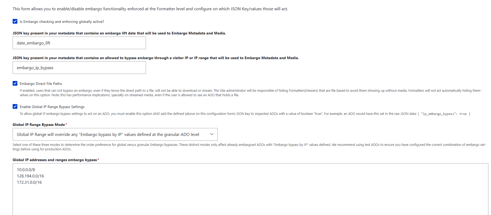

==================================
Restricting Access with IP Embargo
==================================

Archipelago can restrict an ADO's media to visitors on a particular network range while leaving its
metadata public to everyone. We use this for objects whose media lives in Avalon and is licensed for
on-campus viewing only.

This uses Archipelago's built-in metadata-driven embargo with the IP bypass option. No custom module
is needed. See also the upstream `Archipelago embargo documentation <https://docs.archipelago.nyc/1.6.0/embargo/>`_.

.. note::
    The behavior described here was verified against the :code:`format_strawberryfield` module source
    (:code:`src/EmbargoResolver.php`), which differs from the 1.6.0 documentation in a few places. Where
    the two disagree, this page follows the source.

.. warning::
    Embargo is not an access control list. An embargoed ADO is still a published node. Its page loads
    for everyone, it still appears in search and browse, and its metadata exports stay open. Only
    viewers and files are withheld. Read `What IP Embargo Does Not Cover`_ before promising a depositor
    that something is restricted.

--------------------------
How the Embargo Flag Works
--------------------------

Embargo settings name a single flat, top-level key in the ADO's JSON. It is a plain key name, not a
JMESPath expression, so it cannot point at a nested value.

The value stored under that key decides what happens, and its **JSON type matters as much as its
content**:

.. list-table::
   :header-rows: 1
   :widths: 35 65

   * - Value under the key
     - Effect
   * - Key is absent
     - No embargo. The object is public.
   * - :code:`null`, :code:`false`, :code:`0`, :code:`""`, or a blank cell
     - No embargo. The object is public.
   * - :code:`true` (boolean) or :code:`1` (integer)
     - Embargoed. The visitor's IP is checked against the site-wide bypass list. **This is the shape TAMU uses.**
   * - An array of ranges, e.g. :code:`["128.194.0.0/16"]`
     - Embargoed. The visitor's IP is checked against that per-object list.
   * - Any string, including :code:`"1"`, :code:`"T"`, or a URL
     - Embargoed for **everyone, permanently**, on campus included. Never do this.

Why Strings Break Everything
============================

A string value is passed straight to the IP matcher:

.. code-block:: php

    elseif (is_string($jsondata[$ip_embargo_key])) {
      $ip_embargo = IpUtils::checkIp4($current_ip, trim($jsondata[$ip_embargo_key]));
      $noembargo = $noembargo && $ip_embargo;   // -> FALSE
    }

:code:`checkIp4()` cannot parse :code:`"T"`, :code:`"1"`, or a URL, so it returns false and the object is
embargoed. Nothing downstream can undo that, including a request from a campus address. This is why the
flag must be written as a bare :code:`1` and never as a quoted string.

Why We Use a Boolean or Integer Flag
====================================

A :code:`true` or :code:`1` value skips the string branch entirely and is evaluated against the
site-wide list of campus ranges:

.. code-block:: php

    if ($this->embargoConfig->get('global_ip_bypass_enabled')) {
      $global_ip_embargo = ((is_bool($v) && $v == TRUE) || $v == "1" || $v == 1);
      if ($global_ip_embargo) {
        $ip_embargo = $this->evaluateGlobalIPembargo($current_ip);
        $noembargo = $noembargo && $ip_embargo;
      }

Campus ranges then live in **one** configuration field instead of being copied into every object, which
is what we want for a list that changes over time.

Two consequences of taking this branch:

* **Global IP Range Bypass Mode does not apply.** The three-option dropdown
  (:code:`replace` / :code:`additive` / :code:`local`) is only reached when the ADO itself held real IP
  values. With a boolean or integer flag the mode is never read, so its value does not matter.
* **The modes could only ever tighten access anyway.** By the time they run, the local list has already
  been combined with :code:`&&`, so an "additive" list cannot widen access.

--------------------------------
Flagging an Object During Ingest
--------------------------------

The CSV Column
==============

Add an :code:`embargo_ip_bypass` column to the AMI spreadsheet:

* :code:`1` means campus only
* :code:`0` or blank means public

The AMI Ingest Template
=======================

In :code:`twig/metadatadisplays/AMI_Ingest_JSON_Template.twig.html`, the key is emitted after
:code:`related_url`:

.. code-block:: twig

    {# bare 1/null - do NOT use |json_encode|raw here like the keys around it. A quoted string is
       passed to IpUtils::checkIp4(), fails to parse, and embargoes the object for everyone including
       on campus. CSV column: 1 = campus only, 0 or blank = public. #}
    "embargo_ip_bypass": {{ data.embargo_ip_bypass|default('')|trim == '1' ? '1' : 'null' }},

.. warning::
    This line deliberately breaks the :code:`|json_encode|raw` pattern used by every other key in that
    template. "Fixing" it to match its neighbors produces a quoted string, which locks every flagged
    object permanently. The comment above the line is there to stop exactly that.

When the Template Does Not Run
==============================

Some AMI sets are configured for direct column-to-key mapping. In those sets the ADO JSON keys are the
CSV column headers themselves, the Twig ingest template never runs, and raw cell values pass through
untouched. A :code:`T` in the spreadsheet becomes the JSON string :code:`"T"`, which permanently
embargoes the object.

Before relying on the template, confirm which kind of set you are working with, and check the resulting
JSON of at least one object. AMI does coerce some types on the direct path (a :code:`date_issued` of
:code:`1953` arrives as a JSON integer), which is another reason :code:`1` rather than :code:`T` or
:code:`true` is the safest cell value.

-----------------------------
Configuring Embargo in Drupal
-----------------------------

The settings live at :code:`/admin/config/archipelago/metadatabased_Embargo`. The form turns embargo
enforcement on at the formatter level and names the JSON keys it acts on:

Reading the form from top to bottom, these are the values the test site currently holds:

.. list-table::
   :header-rows: 1
   :widths: 34 30 36

   * - Field
     - Value
     - Why
   * - Is Embargo checking and enforcing globally active?
     - Checked
     - The master switch. Nothing below it is consulted while it is off.
   * - JSON key that contains an embargo lift date
     - :code:`date_embargo_lift`
     - Named on the form, but date embargo is not part of this work. The key is inert unless an ADO actually carries it, in which case that object would be embargoed until the date passes.
   * - JSON key that contains an allowed to bypass embargo through a visitor IP or IP range
     - :code:`embargo_ip_bypass`
     - The key this whole feature turns on. It must match the key in the ingest template character for character.
   * - Embargo Direct File Paths
     - Checked
     - The setting that actually refuses a download or stream to someone who knows the direct file path. The form notes it has performance implications for streamed media, and that hiding file-based viewers remains the site administrator's job.
   * - Enable Global IP Range Bypass Settings
     - Checked
     - Without it, a boolean or integer flag is evaluated against nothing and the object stays public.
   * - Global IP Range Bypass Mode
     - Global IP Range will override any granular ADO values
     - A required field, but not read for boolean or integer flags. It only changes behavior for ADOs that carry IP values of their own.
   * - Global IP addresses and ranges embargo bypass
     - Three ranges, described below
     - The allow list.

.. warning::
    Note the key naming in the screenshot. The help text under **Enable Global IP Range Bypass
    Settings** gives its example as :code:`{ "ip_embargo_bypass": true }`, the field above it is set to
    :code:`embargo_ip_bypass`, and the module's own config schema defaults to :code:`ip_embargoed`.
    That is three different names for one key. Only the value typed into the field matters, and an ADO
    whose JSON uses any other spelling is simply public. See `Ways Embargo Silently Does Nothing`_.

The Campus IP Ranges
====================

**Global IP addresses and ranges embargo bypass** takes one CIDR range per line. The test site currently
holds:

.. code-block:: text

    10.0.0.0/8
    128.194.0.0/16
    172.31.0.0/16

.. list-table::
   :header-rows: 1
   :widths: 25 75

   * - Range
     - What it is
   * - :code:`10.0.0.0/8`
     - RFC 1918 private space. On our Kubernetes deployment this covers the cluster's own pod and ingress addresses, including the :code:`10.244.217.104` that dblog reports as the visitor Hostname. A testing entry, not a campus range.
   * - :code:`128.194.0.0/16`
     - The public Texas A&M campus range. This is the entry that does the intended work.
   * - :code:`172.31.0.0/16`
     - RFC 1918 private space used for internal and VPN-style addressing. Also a testing entry rather than a public campus range.

.. warning::
    This list must not go to production as it stands. Two of its three ranges are private space, and
    while the reverse proxy is still unconfigured, Drupal compares each request against the ingress
    address rather than the visitor's. That address falls inside :code:`10.0.0.0/8`, so every request
    matches the bypass list and no object is restricted from anyone. The form reads as correctly
    configured while enforcing nothing.

    A production list should hold only public campus ranges, confirmed with network services, and should
    be set only once the reverse proxy work in `Prerequisites for Production`_ is done. Until then, treat
    the ranges above as scaffolding for testing.

At :code:`/admin/config/archipelago/metadataexpose`, tick **Return 401 in case of an Embargo** on
:code:`iiifmanifest`, :code:`iiifmanifestv2`, :code:`iiifmanifest3cws`, and
:code:`iiifmanifest3collection`. Leave :code:`mods`, :code:`dc`, and :code:`geojson` open so metadata
keeps exporting.

On the display mode formatters, tick **Hide the Viewer in the presence of an Embargo**. There is also an
:code:`embargo_json_key_source` setting, which swaps in an alternate file set when an object is embargoed
(a placeholder image, for example) instead of hiding the viewer altogether.

----------------------------
Showing a Campus-Only Notice
----------------------------

:code:`Object_Description.twig.html` and :code:`Object Display Clover.twig.html` display a campus-only
notice gated on :code:`data_embargo.embargoed`. In :code:`Object_Description`, the notice sits above the
tab content, between :code:`</nav>` and :code:`
`, so it appears whichever tab is
active.

Both templates already carry this flag, which hides the downloads dropdown:

.. code-block:: twig

    
    
       
    

.. note::
    That flag only hides links. It does not block the URLs behind them. Refusing the download itself is
    the job of **Embargo Direct File Paths** in the Drupal settings above.

-------------------------
Roles That Bypass Embargo
-------------------------

:code:`EmbargoResolver.php` short-circuits before any IP logic for:

* the :code:`administrator` role, which is never embargoed under any circumstances
* :code:`see strawberryfield embargoed ados`
* :code:`see strawberryfield time embargoed ados`
* :code:`see strawberryfield IP embargoed ados`

.. warning::
    Always test logged out or in a private window. Testing as an administrator shows content
    unrestricted regardless of your IP, which looks identical to a broken embargo.

----------------------
What IP Embargo Covers
----------------------

The embargo resolver is consulted by:

* :code:`IiifBinaryController`, for direct file downloads, but only when **Embargo Direct File Paths** is on
* :code:`MetadataExposeDisplayController`, for the :code:`/do/…` endpoints, but only where **Return 401 in case of an Embargo** is ticked for that expose config
* :code:`MetadataAPIController` and :code:`MetadataDisplaySearchController`
* the field formatters for Video, Audio, Image, Media, PDF, Paged, Mirador, Universal Viewer, 3D, Map, WARC, Pannellum, Citation, and MetadataTwig
* the :code:`ADOAccess` Views argument validator, which is opt-in

------------------------------
What IP Embargo Does Not Cover
------------------------------

.. list-table::
   :header-rows: 1
   :widths: 30 70

   * - Gap
     - Detail
   * - Search index
     - The module feeding Solr has no embargo awareness. :code:`StrawberryFlavorContentAccess` uses Drupal node access grants, not embargo. Embargoed objects are still published nodes, so they appear in search and browse, and extracted text is indexed regardless.
   * - IIIF Content Search
     - :code:`IiifContentSearchController` injects the embargo resolver but never calls it.
   * - Cantaloupe
     - If the IIIF image server sits on a public hostname, tiles can be fetched directly from it.
   * - Metadata exports
     - :code:`mods.xml`, :code:`dc.xml`, GeoJSON, and OAI-PMH stay open by design. Anything they contain, such as an Avalon URL in :code:`related_url`, is published to harvesters.
   * - Node access
     - Not ACL. The object page still loads for everyone.
   * - IPv6
     - The matcher is :code:`IpUtils::checkIp4()`. A campus visitor arriving over IPv6 is treated as off campus.
   * - Reverse proxy
     - :code:`getClientIp()` returns the proxy's address unless Drupal's :code:`reverse_proxy` settings are configured.
   * - Page cache
     - Disabled for anonymous visitors on any object carrying the embargo key.

.. note::
    The search gap and the ingest decision compound each other. If an ADO carries a text derivative, such as an
    HTML capture of the Avalon page it was built from, that text is indexed and searchable even while the object
    is embargoed. Where the media itself is restricted, the safer choice is not to ingest derivatives of it at
    all rather than to ingest them and rely on embargo.

----------------------------------
Ways Embargo Silently Does Nothing
----------------------------------

Three misconfigurations fail **open**, with no error and no log entry, so the site looks exactly like a
correctly configured one that happens to have nothing restricted:

1. **The key name does not match.** The upstream example uses :code:`embargo_ip_bypass` while the
   module's config schema defaults to :code:`ip_embargoed`. If the settings string and the JSON key
   differ by a single character, every object is public.
2. **Enable Global IP Range Bypass Settings is unticked.** A boolean :code:`true` then matches neither
   the array branch nor the string branch, nothing is evaluated, and the object is public.
3. **The value is falsy.** :code:`false`, :code:`0`, :code:`""`, or a blank cell all read as "no embargo".

One misconfiguration fails **closed**: any non-IP string locks the object to everyone, as described in
`How the Embargo Flag Works`_.

---------------------------
Testing an Embargoed Object
---------------------------

1. Log out, or use a private window. An administrator bypasses everything.
2. Confirm the ADO JSON contains :code:`"embargo_ip_bypass": 1`, unquoted.
3. Set the global bypass addresses to :code:`192.0.2.0/24`, a range that matches nobody. Expect the
   campus-only notice, a hidden viewer, and a **401** from
   :code:`/do/{uuid}/metadata/iiifmanifest/default.jsonld`.
4. Replace it with the address Drupal actually sees for your client, clear caches, and confirm everything
   renders normally.
5. Confirm that a control object without the flag is unaffected in both states.
6. Confirm that a direct :code:`/do/{node}/file/{uuid}/download/{name}` URL returns 403 while embargoed.
   This requires **Embargo Direct File Paths**.

.. note::
    Metadata stays visible in every restricted case. That is by design, not a failed test. The 401 on the
    manifest is the cleanest pass or fail signal.

---------------
Troubleshooting
---------------

* **Nothing appears restricted.** You are probably logged in as an administrator. Retest in a private
  window before changing any configuration.
* **An object is restricted even on campus.** Check the ADO JSON for a quoted value. A string of any kind
  embargoes the object for everyone.
* **Do not draw conclusions while** :code:`10.0.0.0/8` **is in the bypass list.** Campus WiFi NAT and
  container networks live in that range, so it matches the very addresses you are trying to test
  against, including the cluster's own ingress. Remove it, or use :code:`192.0.2.0/24`, the RFC 5737
  documentation range, when you want a list that matches nobody. See `The Campus IP Ranges`_.
* **Find the IP Drupal is comparing against.** Go to :code:`/admin/reports/dblog`, open any entry, and
  read **Hostname**. On our test site this showed :code:`10.244.217.104`, a Kubernetes pod address,
  meaning every request looked identical because Drupal was seeing the ingress rather than the visitor.
* **Never put the proxy address in the bypass list.** Since every request appears to come from it, doing
  so grants campus access to the entire internet while looking like the feature works.
* **An object display template will not render on a test site.** Check for Twig extensions the test site does
  not have. A missing **function**, such as :code:`allmaps_annotation_url`, is a compile-time error that fails
  the whole template and cannot be guarded with :code:``; set the value to :code:`null` for testing
  instead. A missing :code:`attach_library()` target, such as :code:`strawberryfield_clover`, is only a
  warning: the page renders and the Clover JS does not initialize, which is harmless for embargo testing.

----------------------------
Prerequisites for Production
----------------------------

These items are still open, and IP embargo cannot be trusted in production until they are resolved:

1. **Reverse proxy.** :code:`$settings['reverse_proxy']` and :code:`$settings['reverse_proxy_addresses']`
   must be set in :code:`settings.php`, and the ingress must forward :code:`X-Forwarded-For`. Until the
   dblog **Hostname** shows real client addresses, no IP rule can work.
2. **The campus CIDR list.** Available from network services, or from the EZproxy and e-resources
   configuration, which usually maintains one already for vendor licensing. Decide explicitly whether
   VPN, branch campuses, and residence halls count as on campus.
3. **IPv6.** Confirm that campus clients present IPv4 addresses. If they do not, this feature cannot work
   as designed.
4. **How Avalon itself restricts the item.** If Avalon's restriction is login-based rather than IP-based,
   mirroring it as an IP rule is wrong in both directions.
5. **Whether restricted items should be ingested at all.** Not ingesting a poster image and page capture
   is simpler and safer than ingesting them and then relying on embargo.

------------------------------
Checking Avalon's Access State
------------------------------

Avalon exposes an item's access state in two ways:

1. **The HTTP status of its manifest.** :code:`GET /media_objects/<id>/manifest.json` returns :code:`401`
   when restricted and :code:`200` when public. This is only meaningful when requested from outside the
   allowed audience.
2. **The** :code:`Access Restrictions` **entry inside the manifest metadata**, for example
   :code:`"This item is accessible by: the public."` This is authoritative, but only readable once you
   already have access.

A reliable rule is that :code:`401` means restricted, and for :code:`200` you read the
:code:`Access Restrictions` value. Verified samples: :code:`4b29b606w` returns 200 and is public, while
:code:`41687h652` returns 401 and is restricted.

.. warning::
    Twig cannot perform this check. No registered Archipelago Twig extension makes HTTP requests, so any
    manifest-based determination has to happen before ingest, while the spreadsheet is being prepared.
