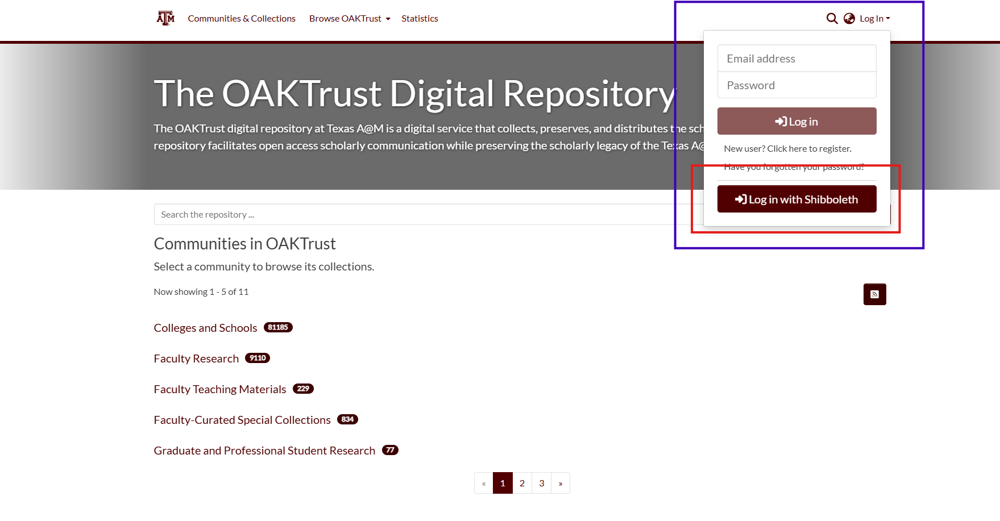

====================================
DSPACE: Extending Embargos in DSpace
====================================

--------------------------------------------------------------------------------
Background — how OAKTrust embargo works (so you understand what you’re changing)
--------------------------------------------------------------------------------

* In modern OAKTrust versions, embargoes are implemented via ResourcePolicy objects (access-policies) attached to an Item or to individual Bitstreams. 
* The “embargo end date” is stored internally as the start date on a policy granting access after embargo. In other words: before that date, access is restricted; at/after that date, the policy becomes active. (Texas Digital Library)
* Thus, to extend an embargo you don’t touch metadata; you modify the ResourcePolicy’s start-date. 
* Manual “embargo-lifter” tools (used in very old OAKTrust versions) are not required in modern versions — the policy system handles the embargo expiry. 

----------------------------------------------------------
Step-by-step: Extending an existing embargo in OAKTrust 10
----------------------------------------------------------
1. **Login as an administrator** (or a user with appropriate rights).

2. **Locate the item** whose embargo you want to extend (via its handle/identifier). Make sure to put the item in double quotes when searching for exact match.

.. image:: ../../_static/images/dspace-searching-a-document.png
    :alt: Searching an item in the repository

3. **Open the item for editing** (commonly: “Edit Item” or similar in the UI).

.. image:: ../../_static/images/dspace-edit-item.png
    :alt: Edit item option in DSpace

4. **Go to the “Status -> Authorizations” section** - From status tab, click on Authorizations button.

.. image:: ../../_static/images/dspace-select-authorization.png
    :alt: Navigate to Authorizations tab   

5. **Identify the relevant policy**
   * If the embargo is at the item level — edit the Item’s policy.
   * If the embargo is at the bitstream level (i.e. specific files) — find the policy for the bitstream(s) you want to change. 
   * Edit bitstream policies by clicking the “Edit Bitstreams” button, then selecting the ORIGINAL, TEXT, and THUMBNAIL bitstreams one at a time to edit their policies.

.. image:: ../../_static/images/dspace-edit-bitsteams.png
    :alt: Edit bitstreams option in DSpace

6. **Edit the “Start date” of the policy** — set it to the new embargo-lift date (i.e. the date when you now want access to begin). 
   
.. image:: ../../_static/images/dspace-change-start-date.png
    :alt: Change start date option in DSpace

7.  **Save/Apply changes.** The new embargo date should take effect immediately. Because your current session may still have admin privileges, you might need to log out and log in as a non-admin to verify that the embargo is actually enforced until the new date. 

---------------------------------------------------------
Known caveats & troubleshooting (things to watch out for)
---------------------------------------------------------
* Some users report issues when trying to reset embargo date — e.g. editing the start date appears successful in the UI, but the change does not persist. This could be a UI bug or a permissions issue.
* For bitstream-level embargo: when switching from embargo to “open access”, ensure you remove the start-date, since “openaccess” policies shouldn’t have a start date per policy in some UI implementations. 
* Because embargo date is stored in policies (not metadata), the embargo date will not automatically appear in metadata exports or DC metadata for public users. If you want a visible record, your repository may need custom metadata or UI changes.
