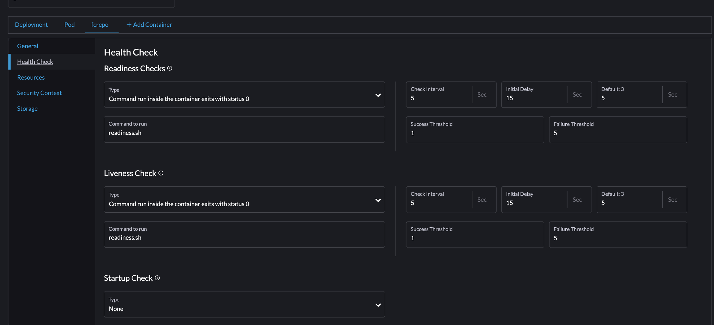

====================
Post Ingestion Tasks
====================

After MagPie runs, there a few things you need to do.

Since we’ve moved to Rancher from Chef, Solr documents don’t get automatically written to fcrepo’s Solr instance. The same goes for the triple store. As a result, you must trigger it by shelling into fcrepo and posting an HTTP request against the Fedora Reindexing Service.

You can get useful information about the service via cURL:

.. code-block:: shell

    curl http://localhost:9080/reindexing

You can POST to the defined re-indexing endpoint, and it will begin to traverse the Fedora repository at that point, sending “re-indexing” hints to the specified services (there are no default services defined).

.. code-block:: shell

    curl -X POST http://localhost:9080/reindexing/ -H "Content-Type: application/json" -d '["broker:queue:solr.reindex","broker:queue:triplestore.reindex"]'

Before you do this, you may need to remove the healthcheck. The settings should look something like this:

You can access this page from :code:`Workloads -> Pod Name (fedora) -> Config -> Health Check`

After running the reindex, you can then watch the logs to make sure every thing is running well like so:

.. code-block:: shell

    # karaf log:
    tail -f /usr/local/karaf/data/log/karaf.log
    ls -al /usr/local/karaf/data/log/

It’s still unclear exactly what needs to happen for this to work. We have also see where adding the liveliness check back seems to make things start working again.

You can also generate a Collection manifest like so:

.. code-block:: shell

    curl  https://api-pre.library.tamu.edu/iiif-service/fedora/collection/bb/97/f2/3e/bb97f23e-803a-4bd6-8406-06802623554c/london-maps-batch-2-jamess-test
