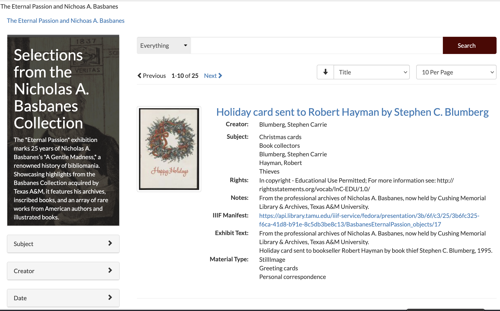
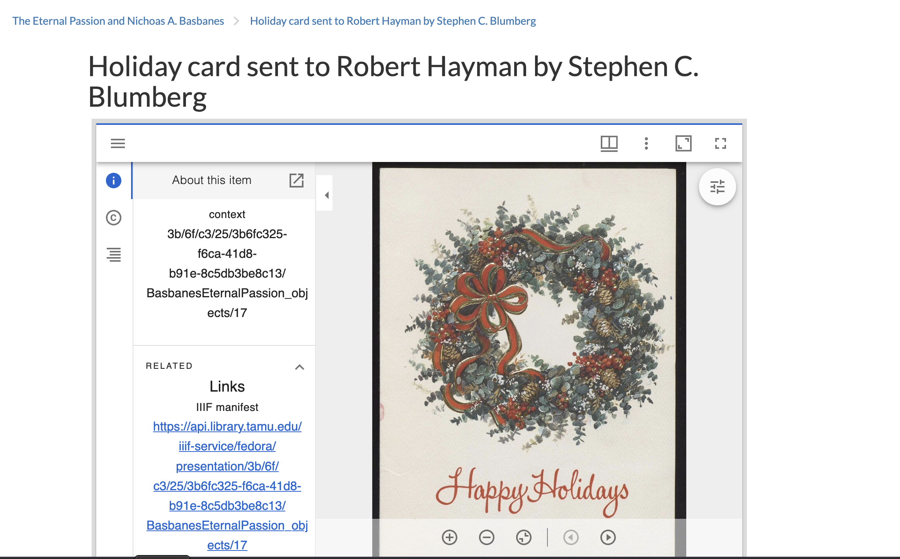

============
Finding IIIF
============

This document explains how to find IIIF manifests and image responses at TAMU libraries.

------------------------------
Presentation API and Manifests
------------------------------

The `IIIF Presentation API <https://iiif.io/api/presentation/2.1/>`_ provides the information necessary to allow a rich,
online viewing environment for compound digital objects to be presented to a human user, often in conjunction with the
IIIF Image API.

This section describes where to find IIIF presentation manifests across our various platforms.

Avalon
======

In Avalon, the manifest identifier can be found by clicking the :code:`Share` button.

.. image:: ../../_static/images/soderquist.png
    :alt: Screenshot of Interview with Ellen Soderquist

You can pass that URL to a viewer like `RAMP <https://ramp.avalonmediasystem.org/?iiif-content=https://avalon.library.tamu.edu/media_objects/000000132/manifest>`_ or `Theseus <https://theseusviewer.org/?iiif-content=https://avalon.library.tamu.edu/media_objects/000000132/manifest>`_.

Spotlight
=========

In Spotlight, the IIIF link is often clear from the browse page.

.. image:: ../../_static/images/spotlight-browse-iiif.png
    :alt: Screenshot of Spotlight Browse

If it's not, you can see the IIIF link inside the Mirador viewer like this:

.. image:: ../../_static/images/spotlight-mirador-viewer.png
    :alt: Screenshot of Spotlight Mirador with IIIF Link

SAGE
====

Similarly, in SAGE, you can see the manifest link in browse:

Or in the viewer itself:

OpenOni
=======

While not publicized, all items in OpenOni are represented by a IIIF manifest.  You can get a copy by add :code:`.json`
to the end of the URL.

For instance, `the Battalion <https://newspaper.library.tamu.edu/lccn/sn86088544>`_ is available `as IIIF <https://newspaper.library.tamu.edu/lccn/sn86088544.json>`_.

No IIIF
=======

Internet Archive BookReader does not have IIIF.
