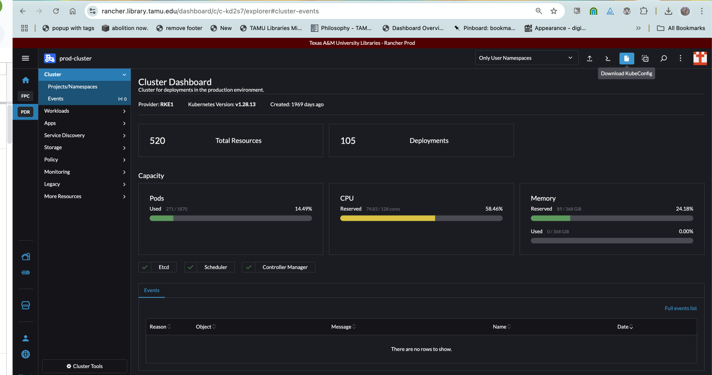

==============================================================
Configuring and Using Kubectl to Access PODs without a Browser
==============================================================

In the Libraries, we use Rancher for orchestration of our many Docker Containers and workloads of isolated networks.

As a result, most people just use Rancher for terminal access, but if you are used to working in a UNIX like environment,
this can be a headache.  This describes how I connect to running pods using :code:`Kubectl`.

------------------
Installing Kubectl
------------------

Before you do anything, you must install :code:`Kubectl`.  Directions for many operating systems can be found on the
`Kubernetes website <https://kubernetes.io/docs/tasks/tools/>`_.

-------------------
Configuring Kubectl
-------------------

Configuring Kubectl is very easy but needs to be done for each Rancher cluster environment.

Login to Rancher and click the Cluster you want.  Then, download the config for Kubectl by clicking **Download KubeConfig**:

Once you've downloaded your various configs, but them somewhere like :code:`~/.configs` and add them to path.  I do this
through my :code:`~/.zshrc`.

.. code-block:: shell

    # Kubeconfigs
    export KUBECONFIG=/Users/mark.baggett/.configs/prod-cluster.yaml:/Users/mark.baggett/.configs/dev-cluster.yaml:/Users/mark.baggett/.configs/pre-cluster.yaml

------------------
Switching Contexts
------------------

In order to connect to the right cluster, you must set your context.  First, you can see your current context like so:

.. code-block:: console

    $ kubectl config get-contexts
    CURRENT   NAME           CLUSTER        AUTHINFO       NAMESPACE
              dev-cluster    dev-cluster    dev-cluster
              pre-cluster    pre-cluster    pre-cluster
    *         prod-cluster   prod-cluster   prod-cluster

In the example, I'm on prod.  To switch to pre I can:

.. code-block:: console

    $ kubectl config use-context pre-cluster
    Switched to context "pre-cluster".

----------
Connecting
----------

Now, I need the id for my pod.  To get it, I can find the ids of all pods in a workload like:

.. code-block:: console

    $ kubectl get pods -n cantaloupe
    NAME                          READY   STATUS    RESTARTS   AGE
    cantaloupe-864ccd85fb-6xbh4   1/1     Running   0          24h
    cantaloupe-864ccd85fb-7bnml   1/1     Running   0          24h

And I can connect to the second one like:

.. code-block:: console

    $ kubectl exec -it cantaloupe-864ccd85fb-7bnml -n cantaloupe -- /bin/sh
